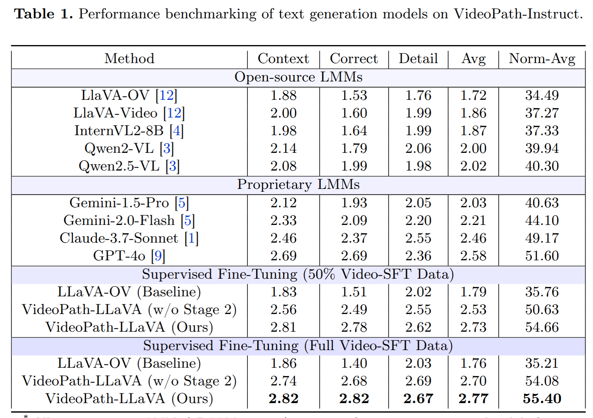

# VideoPath-LLaVA: Pathology Diagnostic Reasoning Through Video Instruction Tuning
[[📜 arXiv]](https://arxiv.org/abs/2505.04192) [[🌐 Project Page]](https://trinhvg.github.io/videopath-llava.github.io/)

🧠 Introducing our VideoPath-LLaVA: the first multimodal model for diagnostic reasoning in pathology through video-based instruction. 🔬📽️
Our method leverages chain-of-thought (CoT) prompting to distill the reasoning capabilities of LLMs. VideoPath-LLaVA generates both detailed histological descriptions and final diagnoses, simulating how pathologists analyze and sign out cases.
📚 Trained on 4,278 instructional video pairs
⚙️ Combines single-image + clip transfer and fine-tuning on segmented diagnostic videos

<p align="center" width="100%">

</p>

# Examples
<p align="center" width="100%">

</p>

# Results
<p align="center" width="100%">

</p>

## Citation
If any part of this code is used, please give appropriate citation to our paper. <br />

BibTex entry: <br />
```
@misc{vuong2025videopathllavapathologydiagnosticreasoning,
      title={VideoPath-LLaVA: Pathology Diagnostic Reasoning Through Video Instruction Tuning}, 
      author={Trinh T. L. Vuong and Jin Tae Kwak},
      year={2025},
      eprint={2505.04192},
      archivePrefix={arXiv},
      primaryClass={cs.CV},
      url={https://arxiv.org/abs/2505.04192}, 
}
```
